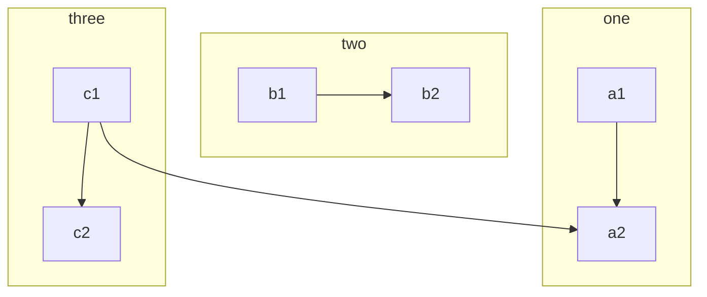
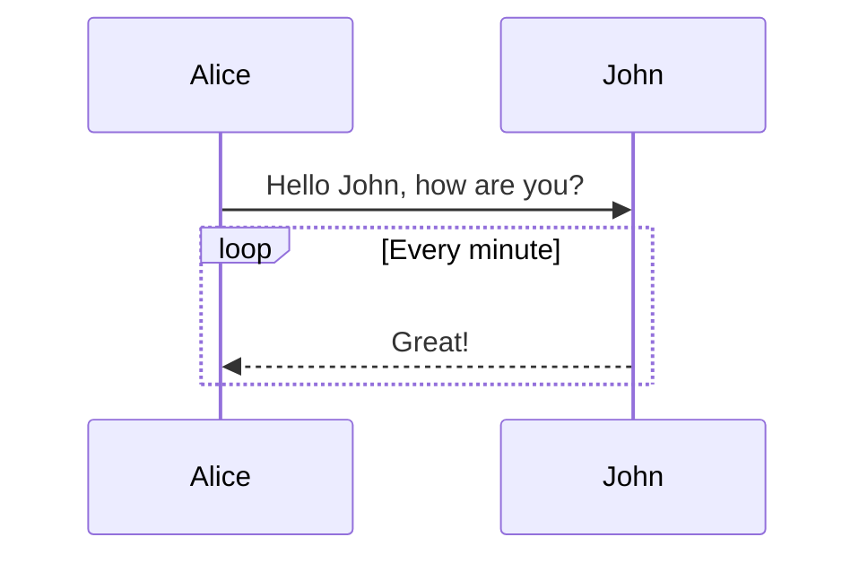
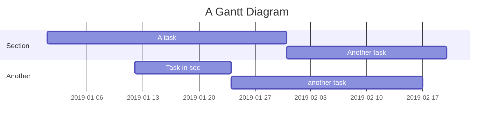
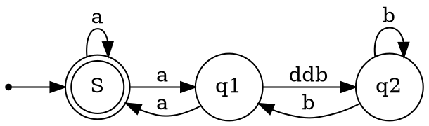

# wowEditor

> wowEditor 是一款**所见即所得**编辑器，支持 *Markdown*。

* 不熟悉 Markdown 可使用工具栏或快捷键进行排版
* 熟悉 Markdown 可直接排版，也可切换为分屏预览

更多细节和用法请参考添加微信: wx2249096563，同时也欢迎向我们提出建议或报告问题，谢谢 ❤️

## 全局的功能

### 快捷键

1. 删除所选块 —— crtl+D
2. 保存 ——ctrl+S
3. 在上方插入一行——ctrl+shift+Q
4. 在下方插入一行——ctrl+shift+E

**当然我们也可以鼠标右键进行以上的操作**

## 教程

这是一篇讲解如何正确使用 **Markdown** 的排版示例，学会这个很有必要，能让你的文章有更佳清晰的排版。

> 引用文本：Markdown is a text formatting syntax inspired
> 
> 啦啦啦，这个东西快捷键为(ctrl+shift+Q)

## 语法指导

### 普通内容

这段内容展示了在内容里面一些排版格式，比如：

- **加粗(ctrl + B)** - `**加粗**!`
- *倾斜(ctrl + I)* - `*倾斜*`
- ~~删除线(Alt + Ctrl + S)~~ - `~~删除线~~`
- `Code 标记(Ctrl + G)` - `` `Code 标记` ``
- [超级链接](https://www.baidu.com)(Ctrl + K) - `[超级链接](https://wwwbaidu.com.com)`
- [发送邮件到2249096563@qq.com](mailto:2249096563@qq.com) - `[username@gmail.com](mailto:2249096563@qq.com)`

### 提及用户

@Vanessa 通过 `@User` 可以在内容中提及用户，被提及的用户将会收到系统通知。

> NOTE:
> 
> 1. @用户名之后需要有一个空格
> 2. 新手没有艾特的功能权限

### 表情符号 Emoji

支持大部分标准的表情符号，可使用输入法直接输入，也可手动输入字符格式。通过输入 `:` 触发自动完成，可在个人设置中[设置常用表情](https://ld246.com/settings/function)。

#### 一些表情例子

😄 😆 😵 😭 😰 😅  😢 😤 😍 😌
👍 👎 💯 👏 🔔 🎁 ❓ 💣 ❤️ ☕️ 🌀 🙇 💋 🙏 💢

### 大标题 - Heading 3（快捷键ctrl + 1 ~ 6）

你可以选择使用 H1 至 H6，使用 ##(N) 打头。建议帖子或回帖中的顶级标题使用 Heading 3，不要使用 1 或 2，因为 1 是系统站点级，2 是帖子标题级。

> NOTE: 别忘了 # 后面需要有空格！

#### Heading 4(ctrl + 4)

##### Heading 5(ctrl + 5)

###### Heading 6(ctrl + 6)

### 图片(鼠标右键可以插入图片)


（鼠标右键调整图片位置）


### 代码块（ctrl + shift + k）

#### 普通

```
*emphasize*    **strong**
_emphasize_    __strong__
var a = 1
```

#### 语法高亮支持

如果在 ``` 后面跟随语言名称，可以有语法高亮的效果哦，比如:

##### 演示 Go 代码高亮

```go
package main

import "fmt"

func main() {
	fmt.Println("Hello, 世界")
}
```

##### 演示 Java 高亮

```java
public class HelloWorld {

    public static void main(String[] args) {
        System.out.println("Hello World!");
    }

}
```

> Tip: 语言名称支持下面这些: `ruby`, `python`, `js`, `html`, `erb`, `css`, `coffee`, `bash`, `json`, `yml`, `xml` ...

### 无序(ctrl+shift+})、有序(ctrl+shift+{)、任务列表(ctrl+j)

#### 无序列表

- Java
  - Spring
    - IoC
    - AOP
- Go
  - gofmt
  - Wide
- Node.js
  - Koa
  - Express

#### 有序列表

1. Node.js
   1. Express
   2. Koa
   3. Sails
2. Go
   1. gofmt
   2. Wide
3. Java
   1. Latke
   2. IDEA

#### 任务列表（ctrl+J）

- [x] 发布 Sym
- [x] 发布 Solo
- [ ] 预约牙医

### 表格(ctrl+t)

如果需要展示数据什么的，可以选择使用表格。

| header 1 | header 2 |
| -------- | -------- |
| cell 1   | cell 2   |
| cell 3   | cell 4   |
| cell 5   | cell 6   |

### 隐藏细节

<details>
<summary>这里是摘要部分。</summary>
这里是细节部分。
你好呀
</details>

### 链接引用

[链接文本][链接标识]

```
[链接文本][链接标识]

[链接标识]: https://b3log.org
```

### 数学公式测试

多行公式块：

$$
\frac{1}{
  \Bigl(\sqrt{\phi \sqrt{5}}-\phi\Bigr) e^{
  \frac25 \pi}} = 1+\frac{e^{-2\pi}} {1+\frac{e^{-4\pi}} {
    1+\frac{e^{-6\pi}}
    {1+\frac{e^{-8\pi}}{1+\cdots}}
  }
}
$$

行内公式：

公式 $a^2 + b^2 = \color{red}c^2$ 是行内。

### 脑图

```mindmap
- 教程
- 语法指导
  - 普通内容
  - 提及用户
  - 表情符号 Emoji
    - 一些表情例子
  - 大标题 - Heading 3
    - Heading 4
      - Heading 5
        - Heading 6
  - 图片
  - 代码块
    - 普通
    - 语法高亮支持
      - 演示 Go 代码高亮
      - 演示 Java 高亮
  - 有序、无序、任务列表
    - 无序列表
    - 有序列表
    - 任务列表
  - 表格
  - 隐藏细节
  - 段落
  - 链接引用
  - 数学公式
  - 脑图
  - 流程图
  - 时序图
  - 甘特图
  - 图表
  - 五线谱
  - Graphviz
  - 多媒体
  - 脚注
- 快捷键
```

### 流程图



### 时序图



### 甘特图



### 图表

```echarts
{
  "title":{"text":"ECharts 入门示例"},
  "tooltip":{},
  "legend":{"data":["销量"]},
  "xAxis":{"data":["衬衫","羊毛衫","雪纺衫","裤子"]},
  "yAxis":{},
  "series":[{"name":"销量","type":"bar","data":[5,20,36,10]}]
}
```

### 五线谱

```abc
X: 24
T: Clouds Thicken
C: Paul Rosen
S: Copyright 2005, Paul Rosen
M: 6/8
L: 1/8
Q: 3/8=116
R: Creepy Jig
K: Em
|:"Em"EEE E2G|"C7"_B2A G2F|"Em"EEE E2G|\
"C7"_B2A "B7"=B3|"Em"EEE E2G|
"C7"_B2A G2F|"Em"GFE "D (Bm7)"F2D|\
1"Em"E3-E3:|2"Em"E3-E2B|:"Em"e2e gfe|
"G"g2ab3|"Em"gfeg2e|"D"fedB2A|"Em"e2e gfe|\
"G"g2ab3|"Em"gfe"D"f2d|"Em"e3-e3:|
```

### Graphviz



### Flowchart

```flowchart
st=>start: Start
op=>operation: Your Operation
cond=>condition: Yes or No?
e=>end

st->op->cond
cond(yes)->e
cond(no)->op
```

### 多媒体

支持 v.qq.com，youtube.com，youku.com，coub.com，facebook.com/video，dailymotion.com，.mp4，.m4v，.ogg，.ogv，.webm，.mp3，.wav 链接解析

https://v.qq.com/x/cover/zf2z0xpqcculhcz/y0016tj0qvh.html

### 脚注

这里是一个脚注引用[^1]，这里是另一个脚注引用[^bignote]。

```
这里是一个脚注引用[^1]，这里是另一个脚注引用[^bignote]。
[^1]: 第一个脚注定义。
[^bignote]: 脚注定义可使用多段内容。

    缩进对齐的段落包含在这个脚注定义内。
```

```
可以使用代码块。
```

还有其他行级排版语法，比如**加粗**和[链接](https://b3log.org)。

## 结语

* 不熟悉 Markdown 可使用工具栏或快捷键进行排版
* 熟悉 Markdown 可直接排版，也可切换为分屏预览
  

